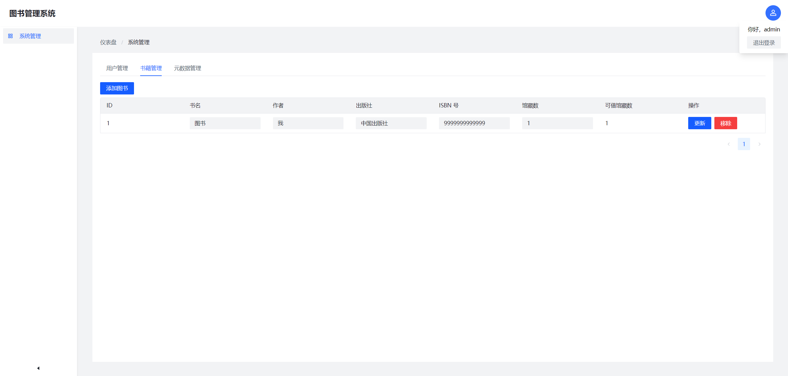
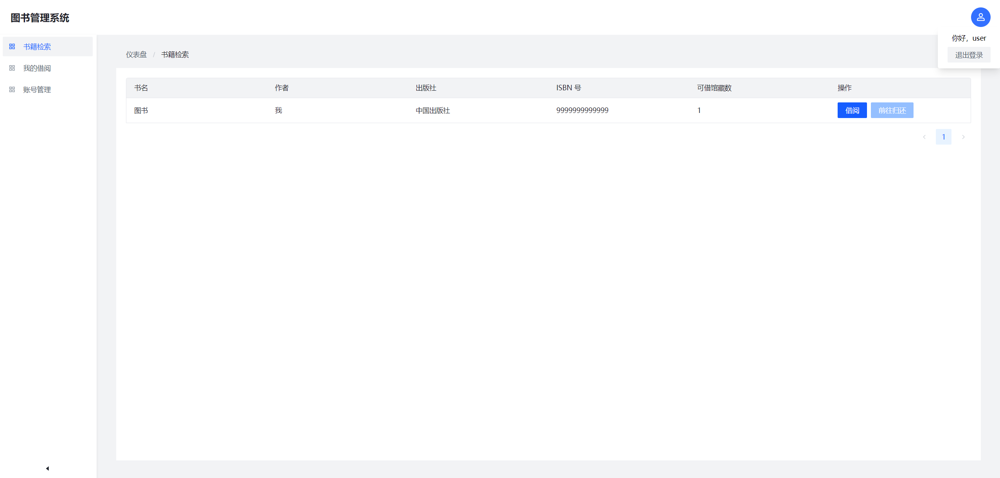

# AnotherLibraryManagementSystem

又一个（没什么卵用的）图书管理系统，基于 Spring Boot 和 Vue 构建。





## 项目架构和技术栈

### 后端([./app](./app))

- 语言：Java 17
- 框架：Spring Boot 3
- 包管理器和构建工具：Gradle
- ORM：Spring Data JPA
- 鉴权：Sa-Token
- 其他：Lombok, H2 Driver 等

### 前端([./ui](./ui))

- 语言：TypeScript
- 框架：Vue
- 构建工具：Gradle、Vite
- 包管理器：pnpm
- UI 框架：Arco Design、Tailwind CSS
- 路由：Vue-Router
- 状态管理：Pinia
- 其他：`vueuse`, `autoprefixer`, `unplugin-auto-import` 等

## 构建

运行：`./gradlew build`，随后即可在 `./app/build/libs` 找到编译结果。

## 运行

运行：`java -jar ./app/build/libs/app-1.0.0-SNAPSHOT.jar`

默认管理员用户名密码均为 `admin`

## 配置

```properties
app.admin.username=admin # 默认用户名
app.admin.password=admin # 默认密码
```

## 开源协议

MIT License
